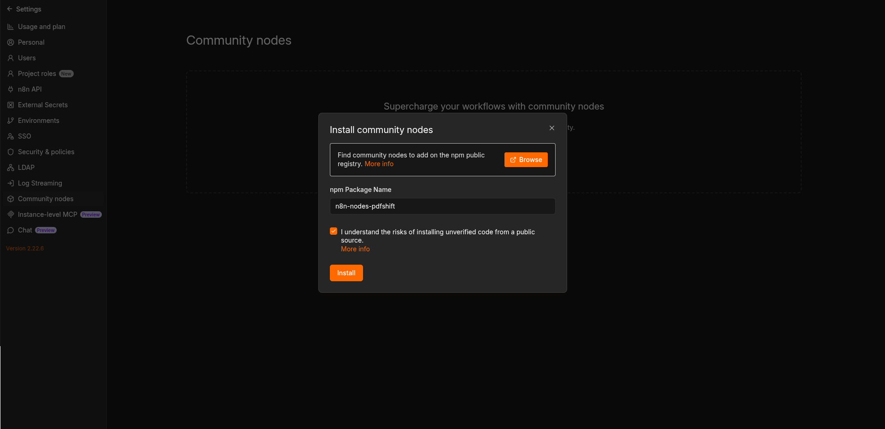
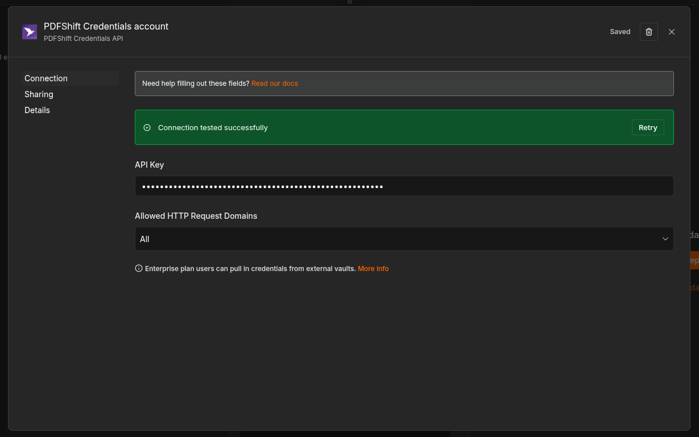

# n8n-nodes-pdfshift

[](https://pdfshift.io/)

`n8n-nodes-pdfshift` is an n8n community node.
It lets you use [PDFShift](https://pdfshift.io/) in your n8n workflows.

[n8n](https://n8n.io/) is a [fair-code licensed](https://docs.n8n.io/reference/license/) workflow automation platform.

PDFShift is a service that allows you to generate PDF or screenshot images from HTML documents such as URL and raw documents.

You can read more at [PDFShift's website](https://pdfshift.io)

- [Installation](#installation)
- [Operations](#operations)
- [Credentials](#credentials)
- [Compatibility](#compatibility)
- [Usage](#usage)
- [Resources](#resources)
- [Development](#development)
- [Version history](#version-history)
- [License](#license)

## Installation

### Community Nodes

Follow the [installation guide](https://docs.n8n.io/integrations/community-nodes/installation/) in the n8n community nodes documentation:

1. Go to `Settings` > `Community Nodes`.
2. Select `Install`.
3. Enter `n8n-nodes-pdfshift` in `Enter npm package name`.
4. Agree to the risks of using community nodes.
5. Select `Install`.




## Operations

1. **Convert to PDF** from any HTML source, URL or RAW.
2. **Generate a screenshot**, helpful to generate OG:Images, screenshot of any websites and more
3. **View your credits usage** to manage your account and take necessary measures.


## Credentials

To use PDFShift node, you will need to authenticate with the PDFShift API.

1. [Sign up for or sign in to a PDFShift account](https://app.pdfshift.io/).
2. Go to "**API Keys**".
3. Create new credentials in n8n:
   1. Add and use the PDFShift node in your workflow.
   2. Under "Credential to connect with", click "Create New Credential".
   3. Paste the API (access) key you copied in step 2.

Test the credentials and make sure it works:




## Compatibility

The node was created and tested with n8n version `2.22.6`.
But there is no reason it won't work with older and newer versions.


## Usage

If you use n8n for the first time, check out the ["try it out" documentation ](https://docs.n8n.io/try-it-out/) to get started.


### Response types

PDFShift may return the response in different formats based on the request options:

- `json` - for JSON responses, e.g. for PDF or screenshot with `filename` or `s3_destination` provided.
- `binary` - for raw responses, e.g. for PDF of screenshot, by default

Examples:

```json
{
    "data": {
        "success": true,
        "url": "https://s3.amazonaws.com/pdfshift/d/2/2019-05/99c456250a01448686d81752a3fb5beb/15466098-8368-49e1-ac33-ff4c3941a0df.pdf",
        "filesize": 259972,
        "duration": 1500,
        "response": {
            "duration": 2562,
            "status-code": 200
        },
        "executed": "2025-12-02T12:34:56.789Z",
        "pdf_pages": 5
    },
    "filename": "generated.pdf",
    "mimetype": "application/pdf"
}
```

Or:

```json
{
    "binary": "... raw pdf data ..."
}
```


## Resources

- [n8n community nodes documentation](https://docs.n8n.io/integrations/#community-nodes)
- [PDFShift API documentation](https://docs.pdfshift.io/)
- [PDFShift](https://pdfshift.io/)
- [PDFShift Dashboard](https://app.pdfshift.io/)


## Version history

- 0.1.2 - Initial release of the PDFShift node for n8n 🥳
- 0.1.3 - Updated the documentation


## Development

Check out [documentation on creating nodes](https://docs.n8n.io/integrations/creating-nodes/) for detailed information on building and developing the node.

0. Install dependencies:

```bash
npm install
```

1. Build the node

```bash
npm run build
```

2. Link the node to n8n from the node directory

```bash
npm link
```

3. In your `~/.n8n/nodes` directory, link the node:

```bash
npm link n8n-nodes-pdfshift
```

4. Run n8n:

```bash
n8n start
```

Once the node is linked, you need to only rebuild and restart n8n to see the changes.


## License

This project is licensed [under the MIT License](LICENSE.md).
[MIT](https://github.com/n8n-io/n8n-nodes-starter/blob/master/LICENSE.md)
